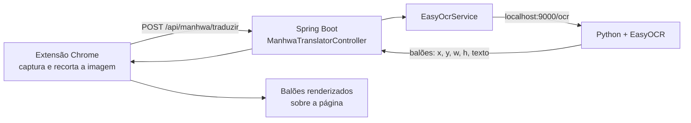

# Resumo do Funcionamento do Projeto

O projeto consiste em um sistema capaz de **identificar e traduzir automaticamente textos presentes em páginas de mangás ou manhwas**, utilizando técnicas de **Reconhecimento Óptico de Caracteres (OCR)** integradas a uma arquitetura baseada em **Spring Boot, Python e uma extensão de navegador**.

A solução foi desenvolvida para capturar imagens de páginas de quadrinhos diretamente de sites de leitura online, identificar os textos presentes nos balões de diálogo e realizar sua tradução para outro idioma, exibindo o resultado sobre a própria imagem.

---

# Arquitetura do Sistema

O sistema é dividido em três componentes principais:

1. **Extensão do navegador**
2. **API backend em Spring Boot**
3. **Serviço de OCR em Python utilizando EasyOCR**

Essa arquitetura permite separar as responsabilidades de captura de imagem, processamento e reconhecimento de texto.

---

# Funcionamento do Fluxo do Sistema

O funcionamento do sistema ocorre através das seguintes etapas:

## Como funciona

# Tecnologias Utilizadas

O projeto utiliza as seguintes tecnologias:

**Backend**

* Java
* Spring Boot
* REST API

**Processamento de imagem**

* Python
* EasyOCR
* OpenCV (opcional para melhorias)

**Frontend**

* JavaScript
* Chrome Extension API
* Manipulação do DOM

---

# Objetivo do Sistema

O objetivo do projeto é desenvolver um **tradutor automático de mangás e manhwas baseado em OCR**, capaz de identificar textos em imagens e integrá-los a um sistema de tradução e renderização diretamente no navegador.

Esse tipo de solução pode ser utilizado em aplicações de:

* leitura automática de quadrinhos
* acessibilidade linguística
* ferramentas de apoio à tradução de conteúdo visual.

